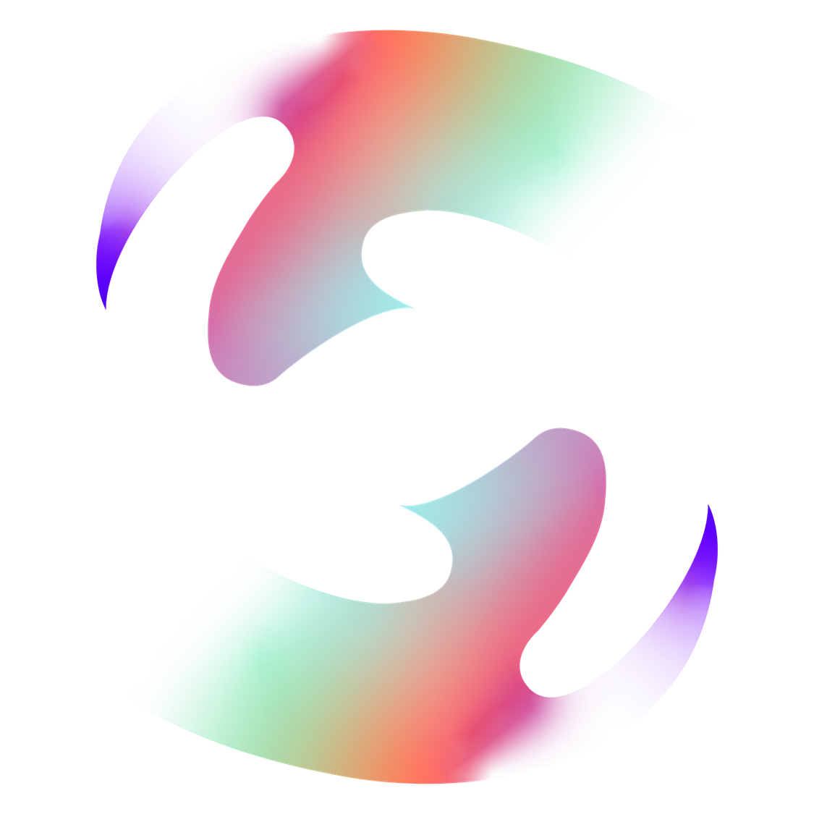
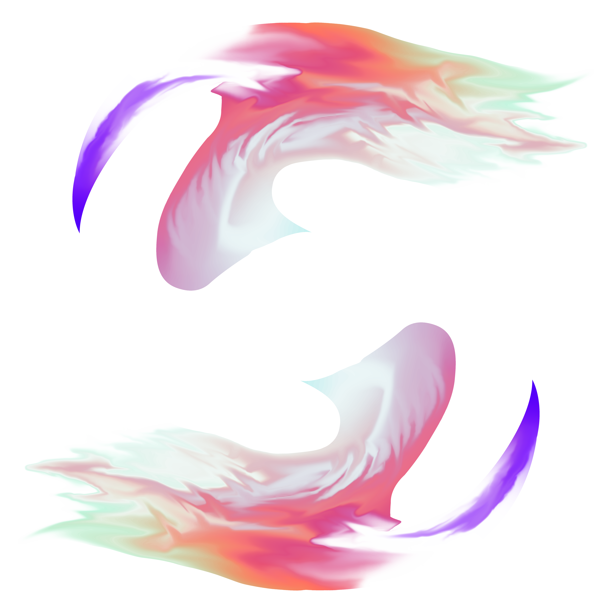

## 👋 Hey there, I'm Osama!  

I'm all about coding 👨‍💻, design 🎨, and animation 🎞️. 
You'll often find me tinkering with JavaScript expressions in After Effects, bringing code to motion. I thrive at merging coding with creativity, which pushes me to bridge the gap between the two worlds.

 

  
  
  

## 💻 Tech Stack:

   
   
  
   
   
  
   
   
   
   
   
   
   
   
   
   
   
   
   
   
   
   
   
   
   
   
   
   
   
   
  
 
  

---

